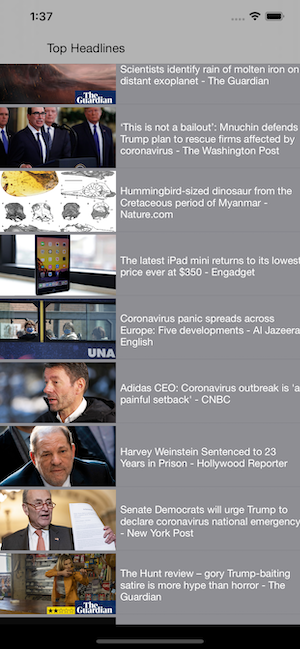
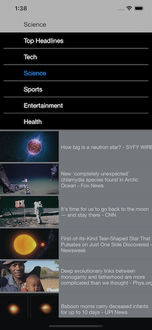

# News

News is a sample iOS app written in Swift that uses news information from newsapi.org to display new about various subjects. It uses a tableview with an async imageview for the cells. It is layed out using constraints programatically. And has a nice dropdown menu.

## License

News is licensed under the MIT License. See the LICENSE file for more information, but basically this is sample code and you can do whatever you want with it.